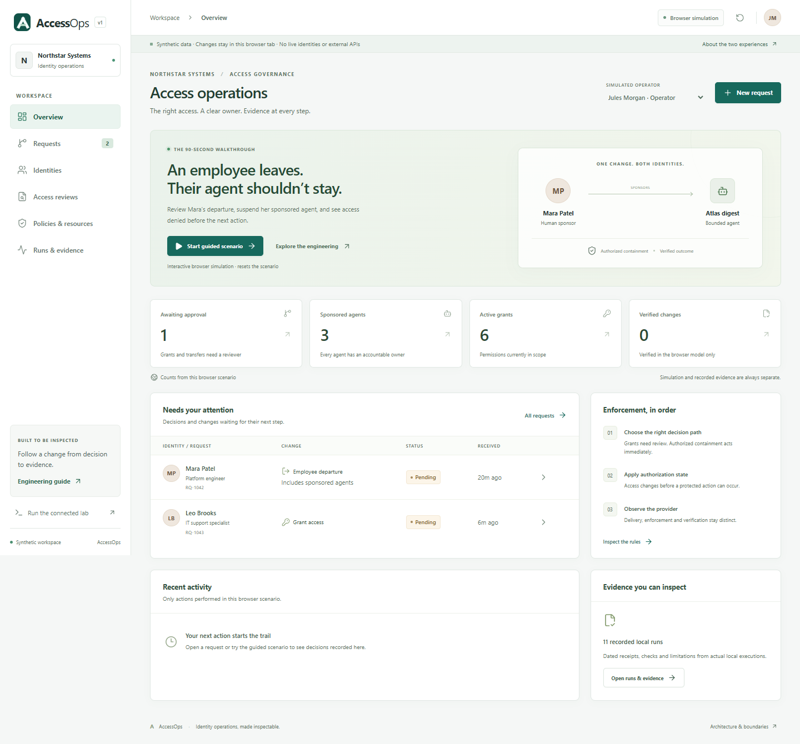

# AccessOps

**Access governance that shows the change, the approval and the observed effect.**

AccessOps is an enterprise-style portfolio reference system for employee and
sponsored-agent access. It connects a readable operations console to lifecycle
workflows, bounded automation, policy decisions and inspectable evidence.
The flagship scenario is an employee departure: remove access, suspend sponsored
automation, deny the next protected action, and show which directory effects
have actually completed.

Everything uses a fictional organization and synthetic records. The public
browser simulation requires no login or paid API. The local lab uses real open
source services. Recorded verification is labeled separately from simulation.



## Try the browser simulation

Node.js 24 is the tested runtime family. From the project directory:

```powershell
cd frontend
npm ci --ignore-scripts
npm run dev
```

Open `http://127.0.0.1:4173`. Start with the guided offboarding scenario, inspect
the request timeline, and open the affected human and sponsored agent. Switch
between the synthetic operator and independent reviewer to see approval rules.
Reset returns to the initial fictional organization.

The six workspace areas connect the executive view to the actual work:

| Area | What it answers |
| --- | --- |
| Overview | What needs an approval, investigation or retry? |
| Requests | What changes, who approved it, and what was applied or verified? |
| Identities | Who owns this identity and which grants remain active? |
| Access reviews | What evidence supports a finding, and is a human decision still required? |
| Policies & resources | Which rules and version explain the decision? |
| Runs & evidence | Which checks actually ran, and which effects remain unknown? |

## Run the connected local lab

The lab is designed for a personal Windows/WSL2 Docker Desktop setup with 16 GB
or more host RAM. It isolates its database, realms, credentials and container
network. Only the HTTPS front door binds to host loopback. Follow the
[connected lab instructions](infra/README.md) and reviewed PowerShell scripts.

Runtime secrets and private keys are generated under `.local/` and excluded from
Git. Do not substitute production data or credentials. The application uses a
server session; OAuth tokens are not placed in browser storage. A public static
build cannot silently become an authenticated connected lab.

## What makes this useful

- **Immediate local containment:** offboarding invalidates current grants and
  suspends sponsored agents independently of directory availability.
- **Independent, expiring approvals:** new access and ownership changes bind to
  the exact request and policy version; approvals expire after fifteen minutes.
- **Durable execution:** local application and remote provisioning are separate
  states. Idempotency and reconciliation protect retries from duplicate effects.
- **Constrained automation:** the assistant receives a fixed task, record set,
  purpose, ten-minute window, six-call budget and one draft. A proposal cannot
  approve or apply itself.
- **Observable drift:** direct directory access without a backed grant is flagged
  for a human decision, never automatically legitimized.
- **Inspectable evidence:** actual test results retain failures and skipped cases;
  released archives can carry detached provenance and SBOM attestations.

## Architecture and standards

React/TypeScript/Vite and Radix provide the console. Django 5.2 LTS and PostgreSQL
provide the transactional governance system. Keycloak separates operator login
from workforce provisioning. A thin AuthZEN adapter provides a swappable policy
boundary in front of OPA. Caddy provides the loopback HTTPS entry point.

The stable agent flow uses an independent client identity with `private_key_jwt`
authentication and current server-side task authorization. Sponsor ownership is
recorded explicitly; it is not fabricated into a delegated OAuth `act` claim.
Preview protocols stay separate from the stable core.

Read the [approved build contract](docs/approved-plan.md), [standards matrix](docs/standards.md),
[threat model](docs/threat-model.md), [API contract](contracts/README.md) and
[evidence verification guide](docs/evidence.md). These documents explain the
boundaries and control mappings without claiming enterprise certification.
The [feedback traceability table](docs/feedback-incorporation.md),
[control-to-test mapping](docs/control-map.md) and
[verification ledger](docs/verification.md) distinguish implemented, measured,
and future profiles.

## Verify it

```powershell
# Backend: create the documented isolated environment and install its lockfile.
cd backend
python -m pytest
cd ../frontend
npm run check
npm test
npm run build
npm run test:e2e
cd ..
python -m unittest discover -s tools -p 'test_*.py'
python backend/run_postgres_tests.py
```

CI checks use read-only permissions. Publishing and evidence signing are manual,
main-branch workflows. The signer does not check out or execute application code.
Third-party actions use immutable revisions. The verification ledger records
what was actually run locally and what still needs a connected or CI run.

## Free operation and maintenance

The browser demo is static and can run on GitHub Pages or any static host. The
lab runs on your own computer. No cloud database, paid model API or commercial
identity platform is required. Optional local AI is a separately measured
enhancement; deterministic replay remains the default.

Public GitHub hosting and standard hosted-runner terms may change. The static
build and local setup remain portable. Review dependency alerts and immutable
image pins monthly; apply upgrades deliberately and rerun denial tests. Avoid
always-on cloud services just to keep a portfolio link alive.

[GitHub Pages is free for public repositories](https://docs.github.com/en/pages/getting-started-with-github-pages/what-is-github-pages).
[Docker Desktop permits free personal/educational use](https://docs.docker.com/subscription-billing/desktop-license/);
Docker Engine with Compose is the portable local alternative. Hosting terms and
organization licensing are reviewed separately from application dependencies.

## Portfolio use

Use the public simulation for a ninety-second walkthrough, then point an
interviewer to a real verification receipt and the offboarding/authorization
tests. The project demonstrates IAM lifecycle design, security automation,
backend APIs, data modeling, policy enforcement and operational troubleshooting.
Describe only the integrations and checks recorded in the verification ledger.

Licensed under Apache-2.0. See [SECURITY.md](SECURITY.md) for responsible reporting.
