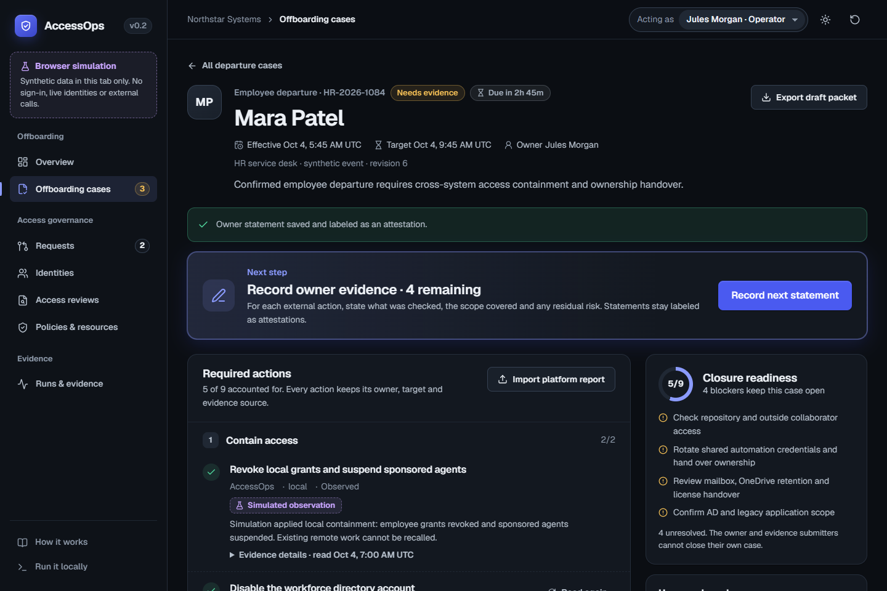

# AccessOps

**Employee and contractor offboarding, closed with evidence.**

When someone leaves, disabling one account is the easy part. AccessOps turns the
HR departure into a case with an owner, a four-hour target and a required action
for every system the person could still reach: local grants and the agents they
sponsor, the workforce directory, Entra sign-in and sessions, GitHub access,
shared credentials, Microsoft 365 handover and legacy apps. A signed HR event
opens the case and contains access within seconds, without waiting for a person.
The case closes only when someone other than the owner accepts the exact
evidence packet.

[Live demo](https://aman-agarwal6.github.io/AccessOps/) ·
[Verification ledger](docs/verification.md) ·
[How it is built](docs/enterprise-application.md)



## Try it

The demo runs entirely in your browser with synthetic data. No sign-in, live
identities or external calls.

1. Open **Mara's departure** from the overview.
2. **Apply local containment.** Grants are revoked and her sponsored agent is
   suspended.
3. **Import the after-departure report.** Entra sign-in clears as an imported
   snapshot; GitHub stays unresolved because absence from a list is not proof.
4. **Record owner statements** for the remaining external work.
5. **Act as Avery** (an independent reviewer), close the case and export the
   frozen packet.

The queue also holds an overdue contractor, a scheduled departure and a closed
historical case. Switch roles from the top bar to see each boundary explained.

## What is real and what is simulated

Every action carries one of these labels, and a label never upgrades itself.

| Evidence | Meaning |
| --- | --- |
| Signed CI evidence | Release bytes bound to the public workflow and source commit by a Sigstore attestation |
| Provider observation | Read back from the lab's real Keycloak or Samba directory after the change |
| Imported snapshot | A bounded report someone supplied; point-in-time and untrusted |
| Owner attestation | A written statement by the case owner, reviewed at closure, never treated as proof |
| Simulated | Produced by the browser demo; nothing outside the tab was contacted |

## Verified results

Measured on 3–4 October 2026 against the local lab (Django, PostgreSQL 17,
Keycloak 26.8, OPA 1.9 and a Samba AD-compatible directory) on the current
backend source. Details, failed attempts and limits are in the
[verification ledger](docs/verification.md).

| Check | Result |
| --- | --- |
| Departure case, end to end through real Keycloak | 18 / 18 passed |
| Departure case with a Samba directory account | 28 / 28 passed |
| New LDAPS and Kerberos logins before → after offboarding | allowed → denied (2 / 2 each) |
| Operator sign-in requires a second factor | 14 / 14 OIDC checks: password then one-time code; a wrong code and a request lowered to password-only are both refused; sessions audited at the `mfa` level |
| Protocol, offboarding, OPA and HTTPS boundary suites | 18, 11, 32 and 5 passed |
| Backend (PostgreSQL / host) and integration suites | 110, 109 + 1 skipped, 145 passed |
| Console unit, browser and accessibility checks | 43 and 33 passed (axe, both themes) |
| Redesigned console in real Firefox against the live lab | Full departure case passed: sign-in, provisioning, containment, owner statements, independent closure |
| Sign-in after departure detected, signalled to the SOC and blocking closure | 7 / 7 passed: detected 32 s after the sign-in; signed CAEP/RISC events verified by a polling receiver |
| Signed HR event → access contained, app signed out and its token refused | 10 / 10 passed: 2.6 s for an effective departure, 2.3 s after a future one takes effect |
| Leaver's sessions and tokens before → after containment | 22 / 22 passed: app session ended by back-channel logout; refresh token, offline token and introspection rejected; an app that checks tokens itself refused the unexpired token 3.0 s after containment, from a signed revocation event |
| Signed [v0.2.0 release](https://github.com/aman-agarwal6/AccessOps/releases/tag/v0.2.0) (GitHub CI) | 255 cases on PostgreSQL 17; provenance and SBOM verified |
| Deployed demo | 17 / 17 checks passed |

The demo's evidence page publishes these reports, including twelve failed
attempts kept on record beside the fixes they led to.

## Run it

Console only (Node.js 24):

```powershell
cd frontend
npm ci --ignore-scripts
npm run dev
```

The full local lab uses Docker Desktop and PowerShell; follow
[infra/README.md](infra/README.md). The optional
[directory lab](docs/directory-lab.md) adds a real Samba directory without a
Microsoft tenant. Secrets are generated under `.local/` and never committed.

## How it is built

- **Console:** React, TypeScript and Vite, with Radix dialogs. Dark and light
  themes from one token set, a 16px type scale, keyboard-first navigation.
- **Backend:** Django and PostgreSQL. Server sessions with OIDC code flow and
  PKCE; no tokens in the browser. CSRF on every mutation.
- **Identity and policy:** Keycloak keeps operator login separate from workforce
  provisioning (SCIM). Every action is checked by OPA through an AuthZEN request,
  and policy failure denies.
- **Execution:** a durable outbox applies remote changes, reads before retrying
  and records actual observation times.
- **Directory:** LDAPS with verified TLS, immutable GUID targets, atomic account
  flag updates and permissions limited to the exact fixture objects.

## Security choices

- Independent approval, bound to the exact change and policy version, expiring
  after 15 minutes.
- Case owners and evidence submitters cannot close their own case.
- Stale, unknown or partial readings keep work open; a disabled account does
  not stand in for removed group memberships.
- Containment also ends the leaver's Keycloak sessions and sends signed
  back-channel logout to apps, and counts only once no session remains.
- HR events must carry a valid Standard Webhooks signature. The HR feed is its
  own identity that can open and contain departures and nothing else.
- For a day after each departure, AccessOps reads the account's sign-ins. Any
  successful one blocks closure until investigated, and the SOC receives signed
  Shared Signals events for containment and for that sign-in.
- Accounts are matched by immutable IDs, never by name or email.
- The review assistant can only propose. It cannot approve or apply anything.
- Every pull request runs CodeQL, dependency review and OSV-Scanner; OpenSSF
  Scorecard rates the repository weekly. See the
  [maintenance guide](docs/maintenance.md) for how findings are handled.

## Limits

This is a reference system with synthetic data, not a production deployment.
No Microsoft or GitHub tenant was contacted; those platforms appear as offline
fixtures and owner statements. Samba results do not prove Microsoft AD
interoperability. Keycloak sessions are ended and earlier tokens rejected; an app
that checks access tokens itself refuses earlier ones only if it follows
AccessOps' revocation signals, as the Atlas lab app does. Samba sessions and
Kerberos tickets are not revoked. Closure is an administrative record, not proof that every copy or
session is gone. See the
[threat model](docs/threat-model.md) and [standards matrix](docs/standards.md).

## Documentation

[Case contract](contracts/offboarding.md) ·
[API contract](contracts/README.md) ·
[Platform connectors](docs/platform-connectors.md) ·
[Control-to-test map](docs/control-map.md) ·
[Evidence verification](docs/evidence.md) ·
[Maintenance](docs/maintenance.md) ·
[Build plan](docs/approved-plan.md)

AccessOps was built with AI coding assistance under my direction and review.
Licensed under Apache-2.0. Report security issues as described in
[SECURITY.md](SECURITY.md).
