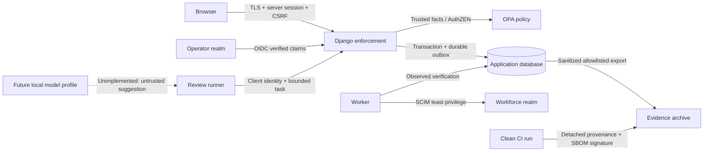

# Threat model

Scope: synthetic single-organization local reference system, public simulation,
and release evidence. STRIDE covers system trust boundaries; CSA MAESTRO covers
the assistant's model, tools, memory/data, identity and orchestration boundaries.
This model is maintained alongside executable denial tests.

| Boundary / threat | Control | Evidence / limit |
| --- | --- | --- |
| Browser spoofs role, identity or owner | Server session mapped by issuer/subject; role/object authorization | Denial tests; public simulation has no authority |
| Cookie request forged | CSRF on mutations, secure same-site cookies, exact redirect configuration | Missing CSRF and unauthenticated request tests |
| Stale or self-issued approval | Independent approver; exact change hash, policy version and 15-minute expiry | Modified change, changed policy and expired approval denial |
| Policy service outage or malformed allow | Explicit boolean decision; bounded timeout; no allow default | Missing result, timeout, stale bundle tests |
| Replay causes duplicate provider effect | Idempotency fingerprint; durable job; observation before retry | Replay conflict, worker retry and partial result checks |
| Offboard races tool action | Current status/grant check inside effect transaction | No new effect after committed revocation; completed reads cannot be recalled |
| Malicious review record instructs the agent | Treat record as data; fixed typed tools; proposals do not approve | Injection fixture and forbidden action tests; no unconstrained tool dispatcher |
| Agent steals sponsor privileges | Independent service identity; current sponsor and task state | Cross-record, expiry, budget and suspension denial |
| Compromised bearer token | Signature/issuer/audience/expiry, introspection and app state | Revocation and JWT edge tests; DPoP is not implemented in this version |
| Directory administrator bypasses approval | Reconcile observed membership against backed grants | Unbacked drift is flagged, never silently legitimized |
| Audit modified by application | Append-only service interface and hash chain | Tamper detection; database/OS administrator can rewrite history |
| Evidence archive modified or wrong issuer | Exact hashes + detached attestation + trusted signer policy | Offline verification; signatures alone do not validate security claims |
| CI privilege escalation from pull request | Read-only checks; isolated manual main-branch signer job | Workflow review; no untrusted PR signing or privileged local runner |
| Emergency path becomes backdoor | Local OS/container access, containment-only actions, required incident/reason | No remote route, no grant creation; OS admin remains a platform trust root |
| Imported account state is assigned to the wrong departure | Explicit stable tenant/subject bindings, no name/email matching | Mismatched account imports denied without partial persistence |
| Partial or stale cloud snapshot is treated as access termination | Strict capability schema, fresh post-departure readings, unknown absence, source labels | Conflicting/stale Entra reads and GitHub absence leave tasks pending |
| Case owner closes their own unverifiable work | Owner-only statements, independent scoped reviewer, current revision/hash/policy | Self-review and changed evidence denied; closed packet retained |
| Departed worker keeps using a session or token issued before containment | Containment disables the account, then calls Keycloak's per-user logout: sessions end, earlier tokens are rejected (not-before) and registered apps receive signed back-channel logout. Verified only when Keycloak lists no session | Live before/after suite; an app that validates access tokens itself, without asking Keycloak, accepts one already issued until it expires (120 s in the lab) |
| Forged or replayed HR event contains someone | Standard Webhooks HMAC over id, timestamp and body; five-minute window; webhook ID as idempotency key; per-address rate limit; one 401 for every failure | Missing, wrong, altered, stale and future signatures change nothing (unit and live) |
| HR feed used for more than departures | The feed is a service principal holding only `hr_intake`; the Python gate and OPA allow it to open a case and execute an offboard request, nothing else. Statements and closure stay with people | Policy cases and service-authority tests; the case owner is the feed's sponsor, an active operator |
| HR event names the wrong person or opens a duplicate | Only an enrolled workforce identity ID is accepted; agents, operators and unknown IDs are refused; a reused event ID with a different departure, or a second event while a case is open, returns 409 | Unit tests; live conflict check |
| HR signing secret is stolen | The secret lives only in server configuration and can be rotated (several `v1` signatures are accepted). Its holder can contain in-scope workers but cannot grant, read, attest or close | Residual: containment by a forged event is a denial of service; restoring access goes through normal approved requests |
| Containment route used for other admin writes | Private edge host allows only POST `.../users/{uuid}/logout` and GET `.../users/{uuid}/sessions` in the workforce realm; exact UUID paths | Connector rejects non-UUID subjects, redirects and foreign session records; all other paths and methods return 404 |
| Old provider success hides later drift or unavailability | Latest timestamped account reading, two-hour freshness, reconciliation refresh | Later enabled/unknown Keycloak readings reopen required work |
| New HR event hides earlier unfinished directory removals | Retained managed-grant history, exact durable removal pairs and fresh per-pair proof | Repeated departure and missing historical-job fixtures stay blocked |
| Mutable directory DN or concurrent account flags retarget a write | Trusted immutable GUIDs, object-specific delegation and atomic old-value LDAP modify | Rename/stale-value denials; real lab checks recorded separately |
| Owner supplies arbitrary directory write targets | Server-local enrollment, frozen case mapping, pre/post-delivery validation | Browser retarget input and tampered job state denied |
| Console presents weaker evidence as provider proof | Provenance derived only from the server's evidence kind and build mode; browser readings always labeled simulated; fixed icon + label + color per kind | Unit and connected-renderer tests: simulated ≠ provider observation; the UI explains rules but never grants authority |

The indirect prompt injection fixture maps to MITRE ATLAS
[AML.T0051.001](https://atlas.mitre.org/techniques/AML.T0051.001), verified against
the [official ATLAS dataset](https://github.com/mitre-atlas/atlas-data/blob/main/dist/ATLAS.yaml).
[CSA MAESTRO](https://cloudsecurityalliance.org/blog/2025/02/06/agentic-ai-threat-modeling-framework-maestro)
provides the agent-layer method.

Agent-specific MAESTRO review asks: Can input alter authority? Can output select a
different record or tool? Can repeated calls exceed budget? Can a revoked task be
resumed? Can an ownerless identity act? Every accepted response is schema-checked
and authorized again at effect time. Optional model installation does not weaken
these boundaries. Technique mapping identifies the scenario; it does not imply
exhaustive coverage of ATLAS or protection against every prompt injection.

Availability limits: disconnected applications cannot receive revocation until
they connect and enforce it. Back-channel logout reaches only applications
registered for it, and an access token already issued stays usable to an
application that never asks Keycloak until it expires. Provider failures remain visible. An administrator
with OS/database control is outside the application's tamper-prevention boundary.
No enterprise deployment, multi-tenancy, certified identity assurance, or general
agent sandbox isolation is claimed by this lab. The current assistant uses a
deterministic runner; no model weights, prompt performance, or generative model
resistance were evaluated. [Control mapping](control-map.md) ties the implemented
boundaries to named tests.
