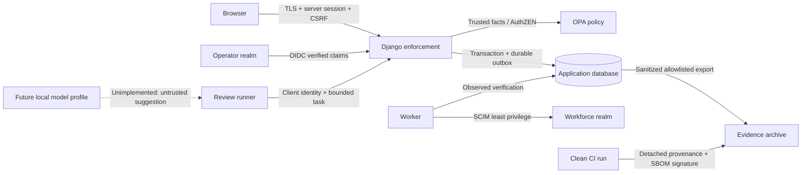

# Threat model

Scope: synthetic single-organization local reference system, public simulation,
and release evidence. STRIDE covers system trust boundaries; CSA MAESTRO covers
the assistant's model, tools, memory/data, identity and orchestration boundaries.
This model is maintained alongside executable denial tests.

| Boundary / threat | Control | Evidence / limit |
| --- | --- | --- |
| Browser spoofs role, identity or owner | Server session mapped by issuer/subject; role/object authorization | Denial tests; public simulation has no authority |
| Cookie request forged | CSRF on mutations, secure same-site cookies, exact redirect configuration | Missing CSRF and unauthenticated request tests |
| Stale or self-issued approval | Independent approver; exact change hash, policy version and 15-minute expiry | Modified change, changed policy and expired approval denial |
| Policy service outage or malformed allow | Explicit boolean decision; bounded timeout; no allow default | Missing result, timeout, stale bundle tests |
| Replay causes duplicate provider effect | Idempotency fingerprint; durable job; observation before retry | Replay conflict, worker retry and partial result checks |
| Offboard races tool action | Current status/grant check inside effect transaction | No new effect after committed revocation; completed reads cannot be recalled |
| Malicious review record instructs the agent | Treat record as data; fixed typed tools; proposals do not approve | Injection fixture and forbidden action tests; no unconstrained tool dispatcher |
| Agent steals sponsor privileges | Independent service identity; current sponsor and task state | Cross-record, expiry, budget and suspension denial |
| Compromised bearer token | Signature/issuer/audience/expiry, introspection and app state | Revocation and JWT edge tests; DPoP is not implemented in this version |
| Directory administrator bypasses approval | Reconcile observed membership against backed grants | Unbacked drift is flagged, never silently legitimized |
| Audit modified by application | Append-only service interface and hash chain | Tamper detection; database/OS administrator can rewrite history |
| Evidence archive modified or wrong issuer | Exact hashes + detached attestation + trusted signer policy | Offline verification; signatures alone do not validate security claims |
| CI privilege escalation from pull request | Read-only checks; isolated manual main-branch signer job | Workflow review; no untrusted PR signing or privileged local runner |
| Emergency path becomes backdoor | Local OS/container access, containment-only actions, required incident/reason | No remote route, no grant creation; OS admin remains a platform trust root |

The indirect prompt injection fixture maps to MITRE ATLAS
[AML.T0051.001](https://atlas.mitre.org/techniques/AML.T0051.001), verified against
the [official ATLAS dataset](https://github.com/mitre-atlas/atlas-data/blob/main/dist/ATLAS.yaml).
[CSA MAESTRO](https://cloudsecurityalliance.org/blog/2025/02/06/agentic-ai-threat-modeling-framework-maestro)
provides the agent-layer method.

Agent-specific MAESTRO review asks: Can input alter authority? Can output select a
different record or tool? Can repeated calls exceed budget? Can a revoked task be
resumed? Can an ownerless identity act? Every accepted response is schema-checked
and authorized again at effect time. Optional model installation does not weaken
these boundaries. Technique mapping identifies the scenario; it does not imply
exhaustive coverage of ATLAS or protection against every prompt injection.

Availability limits: disconnected applications cannot receive revocation until
they connect and enforce it. Provider failures remain visible. An administrator
with OS/database control is outside the application's tamper-prevention boundary.
No enterprise deployment, multi-tenancy, certified identity assurance, or general
agent sandbox isolation is claimed by this lab. The current assistant uses a
deterministic runner; no model weights, prompt performance, or generative model
resistance were evaluated. [Control mapping](control-map.md) ties the implemented
boundaries to named tests.
